SmartThermometer_Arduino & SmartThermometer_Application
---------------------------------------------------------
# 기능
1. 아두이노 미니,비접촉식 적외선 온도 센서로 체온계를 제작 
2. 개발한 어플에 블루투스 통신을 통하여 체온을 보내 간단한 자가진단이 가능
# 개발 기간
- 2019.9.20 ~ 2019.12.6
--------------------------------------------------------
# SmartThermometer_Application
## 1. 개발 환경
- Galaxy S9
- Android Studio

## 2. 구성 및 설명
- [Main4Activity.java](https://github.com/cpcp127/Open-Source/blob/master/Tester/app/src/main/java/com/example/tester/Main4Activity.java) ,
[activity_main4.xml](https://github.com/cpcp127/Open-Source/blob/master/Tester/app/src/main/res/layout/activity_main4.xml)

- 처음으로 이름,성별,나이를 입력하는 액티비티
- 입력후 정보를 확인시켜주는 AlertDialog 띄움

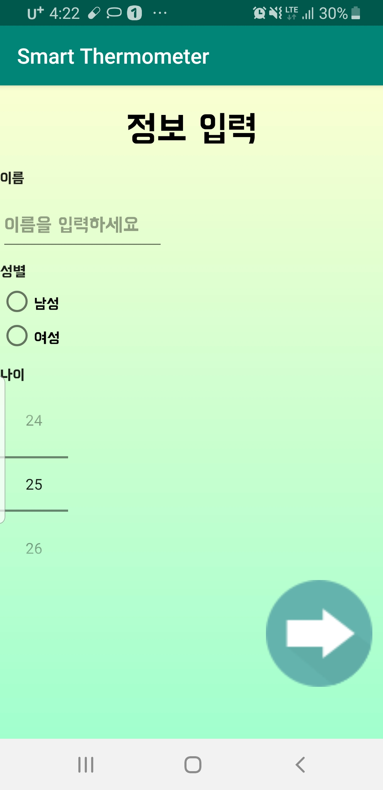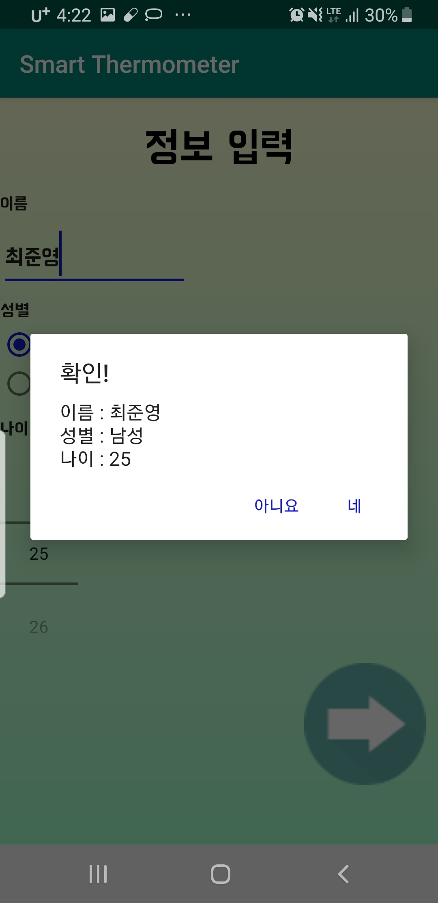

- [Main3Activity.java](https://github.com/cpcp127/Open-Source/blob/master/Tester/app/src/main/java/com/example/tester/Main3Activity.java),[activity_main3.xml](https://github.com/cpcp127/Open-Source/blob/master/Tester/app/src/main/res/layout/activity_main3.xml)
[main.xml](https://github.com/cpcp127/Open-Source/blob/master/Tester/app/src/main/res/menu/main.xml)

- 체온을 받아와서 체온을 확인하고 자가진단 및 예방접종을 확인하는 엑티비티

- 엑티비티 상단에서 블루투스 연결 및 해제 등 블루투스 관련 기능 제공

- 우측에 물을표 버튼을 누르면 자신 체온 나이에 따른 미열, 고열 , 정상 확인가능

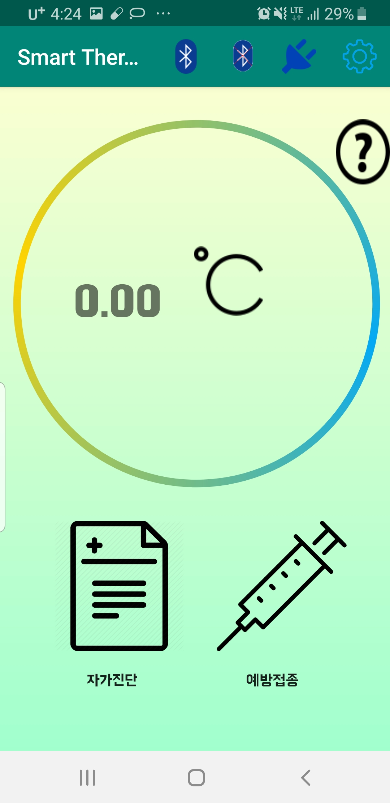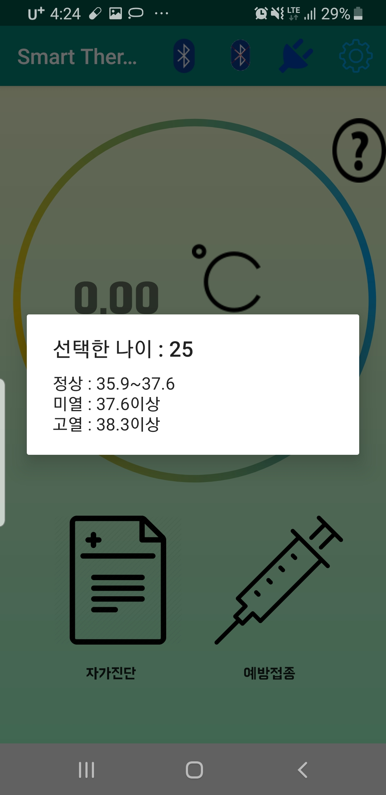

- [MainActivity.java](https://github.com/cpcp127/Open-Source/blob/master/Tester/app/src/main/java/com/example/tester/MainActivity.java) ,
[activity_main.xml](https://github.com/cpcp127/Open-Source/blob/master/Tester/app/src/main/res/layout/activity_main.xml)
- [Main2Activity.java](https://github.com/cpcp127/Open-Source/blob/master/Tester/app/src/main/java/com/example/tester/MainActivity2.java) ,
[activity_main2.xml](https://github.com/cpcp127/Open-Source/blob/master/Tester/app/src/main/res/layout/activity_main2.xml)

- 자가진단을 하고 결과를 보는 엑티비티
- 각 항목마다 어떤 질병이 예상되는지 자기 주관으로 예측가능
- 주위의 약국,병원 찾기 생활습관, 몸에 좋은 음식 확인 가능
- 약국 병원 찾기는 uri intent로 구글에 검색에서 바로 검색
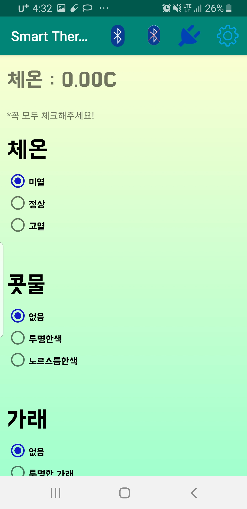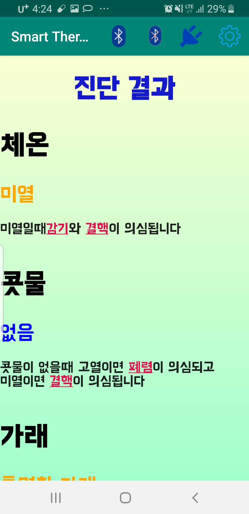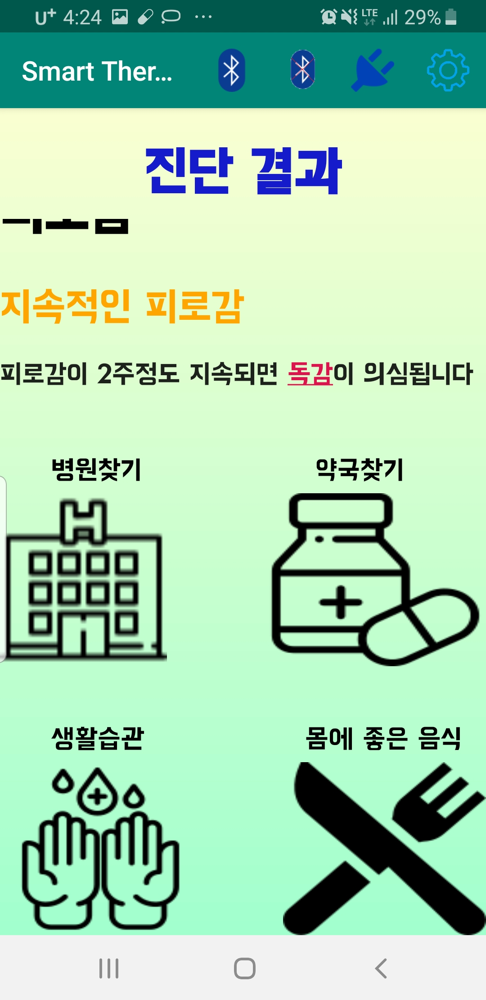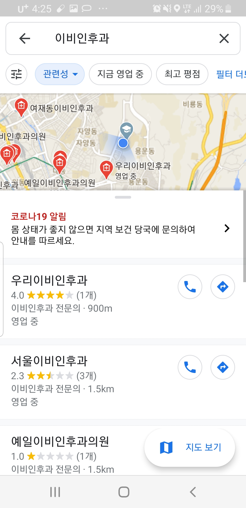

- 자신이 의심되는 질병을 선택한뒤 그 질병에 좋은 음식 및 생활 습관 확인

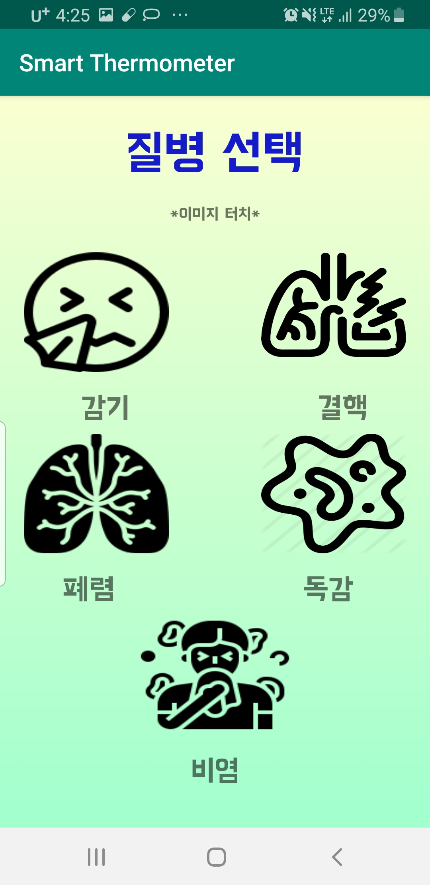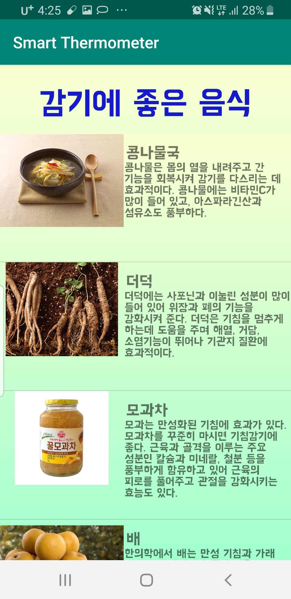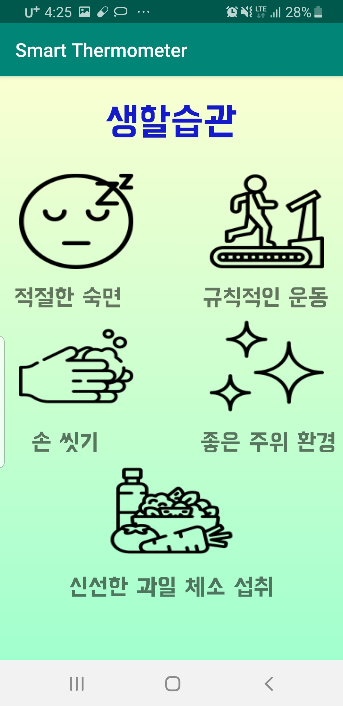

